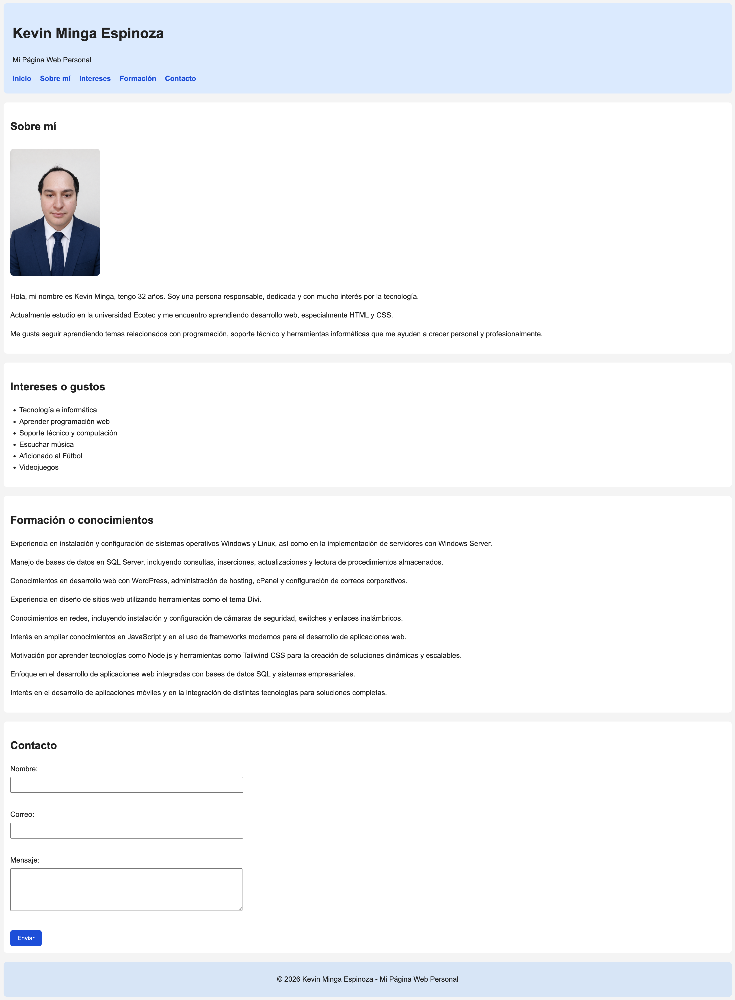
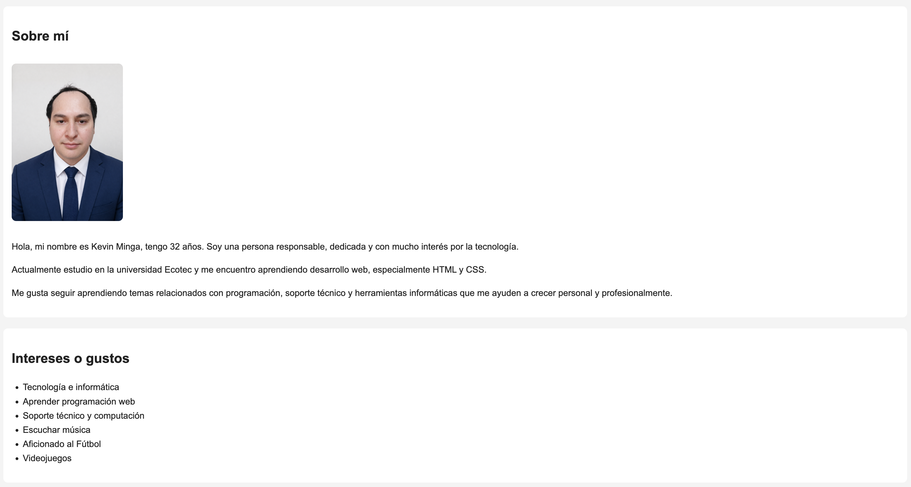
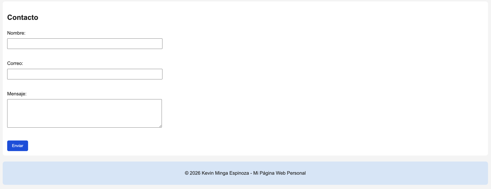

# Actividad Integradora 1 - Mi Primera Página Web Personal

## Descripción
Este proyecto consiste en la creación de una página web personal utilizando HTML y CSS básico, como parte de la Actividad Integradora 1.

## Objetivo
Aplicar correctamente la estructura HTML, el uso de etiquetas semánticas y la organización de la información personal en una página web funcional.

## Contenido de la página
- Encabezado con nombre y título
- Sección sobre mí
- Lista de intereses
- Formación o conocimientos
- Formulario de contacto

## Archivos del proyecto
- `index.html`
- `style.css`
- carpeta `imagenes`
- carpeta `capturas`
- `README.md`

## Tecnologías utilizadas
- HTML
- CSS

## Enlace del repositorio en GitHub
[Ver actividad en GitHub](https://github.com/kevingeovanny16/PROGRAMACION-WEB/tree/main/Actividad-Integradora-1)

## Registro de avances
- Avance 1: creación de la estructura base del proyecto
- Avance 2: incorporación de las secciones obligatorias y formulario
- Avance 3: aplicación de estilos básicos con CSS
- Avance final: revisión del proyecto, capturas y preparación para entrega

## Capturas del proyecto

### Vista general de la página

### Sección sobre mí e intereses

### Formulario de contacto

## Autor
Kevin Minga Espinoza