# KME Inventario y Ventas

Sistema web desarrollado con **PHP, HTML, CSS y JavaScript** para la gestión de productos y el registro de ventas.  
Este proyecto fue elaborado como parte de una actividad académica de **Programación Web**, aplicando organización modular, validaciones, almacenamiento local, control de acceso mediante sesiones y control de versiones con GitHub.

---

## Descripción del sistema

**KME Inventario y Ventas** es una aplicación web sencilla, funcional y con diseño limpio, orientada a:

- registrar productos
- editar productos existentes
- eliminar productos
- controlar stock
- registrar ventas
- descontar stock automáticamente
- visualizar alertas de inventario
- acceder al sistema mediante un login simple

El sistema utiliza **LocalStorage** para almacenar los productos y ventas en el navegador, y **PHP Sessions** para proteger el acceso a los módulos principales.

---

## Características del sistema

- Login simple con credenciales fijas
- Protección de módulos mediante sesión
- CRUD completo de productos
- Validaciones obligatorias en productos
- Registro de ventas con descuento automático de stock
- Historial de ventas
- Dashboard con resumen dinámico
- Alertas de stock bajo y productos agotados
- Buscador de productos por nombre
- Filtro por categoría
- Filtro por estado del stock
- Interfaz limpia, simple y funcional

---

## Tecnologías utilizadas

- PHP
- HTML5
- CSS3
- JavaScript
- LocalStorage
- PHP Sessions
- GitHub

---

## Estructura del proyecto

```text
kme-inventario-ventas/
├── public/
│   ├── auth.php
│   ├── login.php
│   ├── logout.php
│   ├── index.php
│   ├── productos.php
│   ├── ventas.php
│   └── assets/
│       ├── css/
│       │   └── style.css
│       └── js/
│           ├── productos.js
│           └── ventas.js
├── config/
├── models/
├── controllers/
├── services/
├── database/
├── capturas/
└── README.md
```

---

## Funcionalidades implementadas

### 1. Módulo de login

- Inicio de sesión con usuario y contraseña
- Protección de acceso a módulos
- Cierre de sesión

### 2. Módulo de productos

- Crear producto
- Listar productos
- Editar producto
- Eliminar producto
- Buscar por nombre
- Filtrar por categoría
- Filtrar por estado del stock

### 3. Validaciones de productos

- Nombre no vacío
- Precio mayor a 0
- Stock mayor o igual a 0
- No permitir stock negativo

### 4. Módulo de ventas

- Selección de producto
- Registro de cantidad vendida
- Cálculo del total
- Descuento automático del stock
- Historial de ventas

### 5. Dashboard principal

- Total de productos
- Stock total
- Total de ventas
- Valor estimado del inventario
- Productos con stock bajo
- Productos agotados
- Últimas ventas registradas

---

## Requisitos para ejecutar el sistema

Para poner en marcha el proyecto se necesita:

- PHP instalado en el equipo
- Visual Studio Code u otro editor compatible
- Navegador web moderno
- Sistema operativo Windows
- Acceso local al proyecto

---

## Instalación de PHP en Windows

Si el equipo **ya tiene PHP instalado**, se puede pasar directamente a la sección de ejecución del sistema.

Si el equipo **no tiene PHP instalado**, realizar lo siguiente:

1. Descargar e instalar PHP para Windows.
2. Durante la instalación, permitir que PHP quede agregado al **PATH** del sistema.
3. Cerrar y volver a abrir la terminal o Visual Studio Code después de la instalación.
4. Verificar la instalación con el siguiente comando:

```bash
php -v
```

Si el comando muestra la versión de PHP, la instalación quedó correcta.

> Nota: como alternativa, también se puede utilizar un entorno local como XAMPP, siempre que permita ejecutar PHP correctamente.

---

## Puesta en marcha del sistema

1. Descargar o clonar el repositorio.
2. Abrir la carpeta del proyecto en Visual Studio Code.
3. Abrir una terminal en la raíz del proyecto.
4. Verificar que PHP esté instalado correctamente:

```bash
php -v
```

5. Ejecutar el siguiente comando para levantar el servidor local:

```bash
php -S localhost:8000 -t public
```

6. Abrir el navegador y acceder a:

```text
http://localhost:8000/login.php
```

---

## Credenciales del login

El sistema utiliza credenciales fijas para fines académicos:

- **Usuario:** `admin`
- **Contraseña:** `KME2026`

---

## Almacenamiento de datos

Los datos del sistema se guardan en el navegador utilizando **LocalStorage**.

### Claves utilizadas

- `kme_productos`
- `kme_ventas`

### Consideraciones

- Si se limpian los datos del navegador, se perderán los productos y ventas guardados.
- El login utiliza sesión en PHP.
- Los módulos de productos y ventas funcionan con almacenamiento local en el navegador.

---

## Estado actual del proyecto

Actualmente el sistema ya cuenta con:

- login funcional
- CRUD de productos
- validaciones
- módulo de ventas
- panel principal con alertas
- buscador y filtros de productos

---

## Capturas del sistema

### 1. Pantalla de login

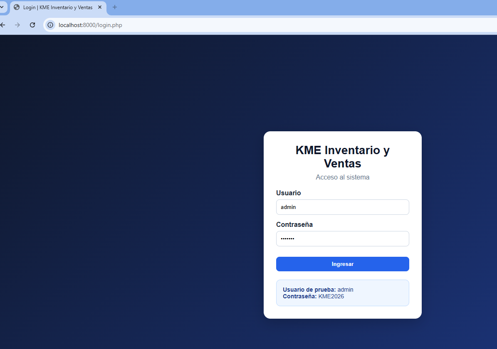

### 2. Dashboard principal

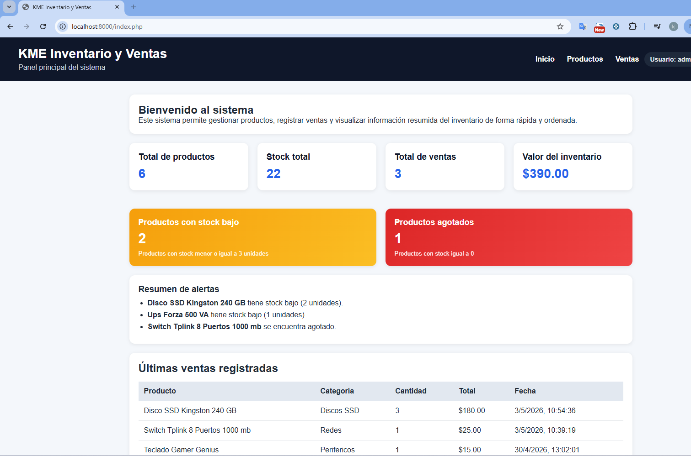

### 3. Registro de productos

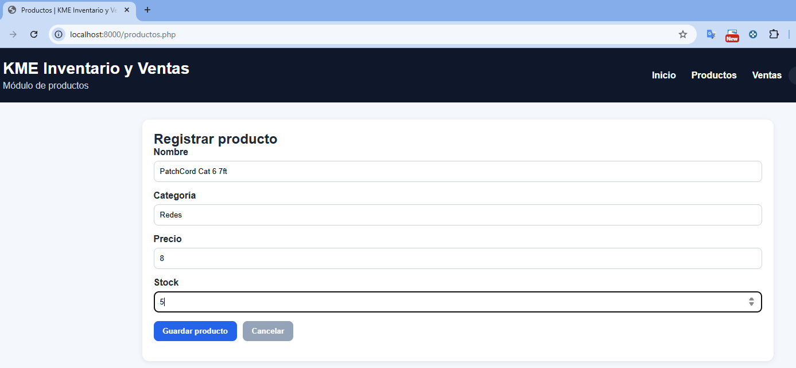

### 4. Listado de productos

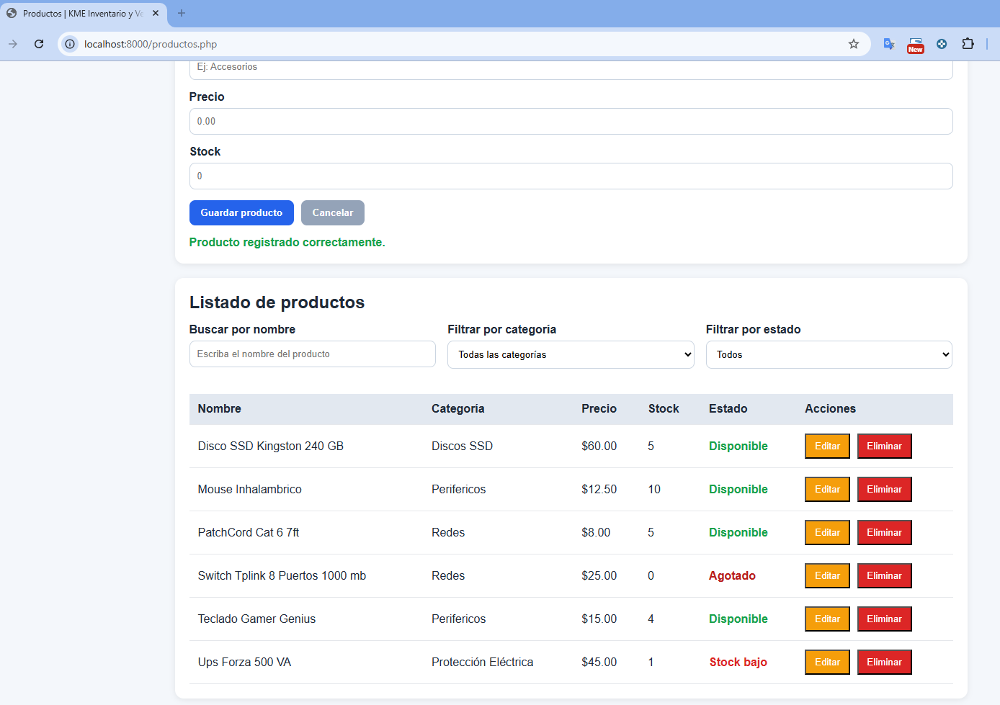

### 5. Validaciones del módulo productos

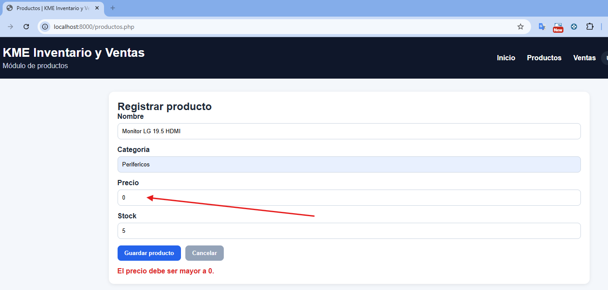

### 6. Edición de productos

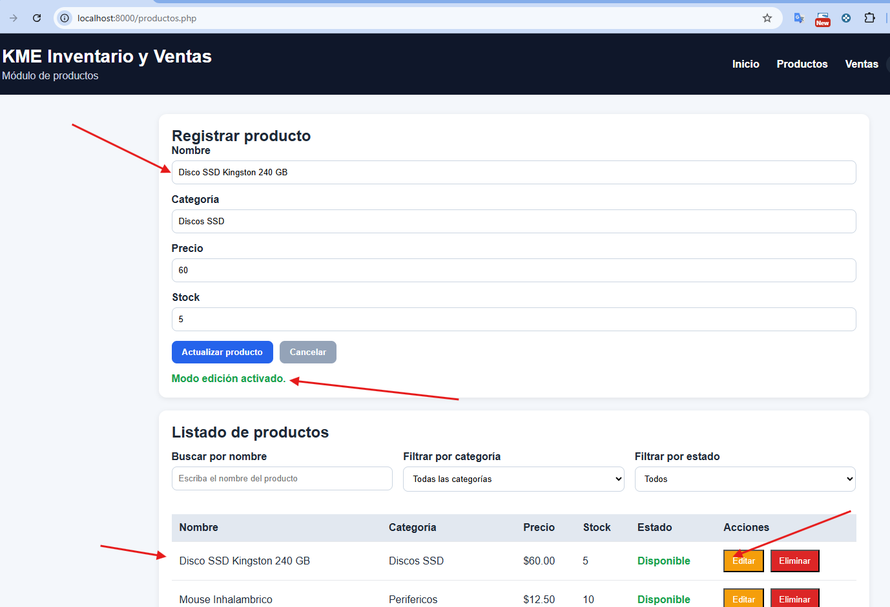

### 7. Eliminación de productos

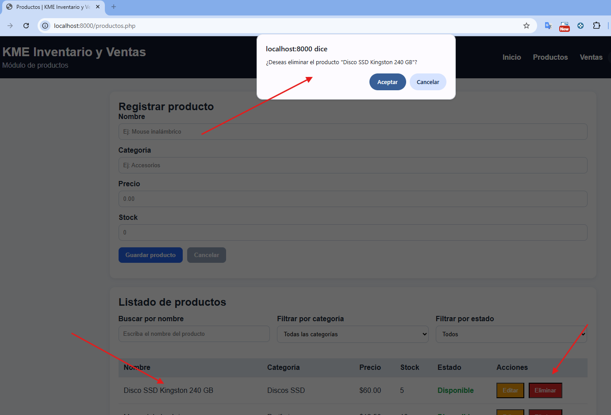

### 8. Buscador y filtros de productos

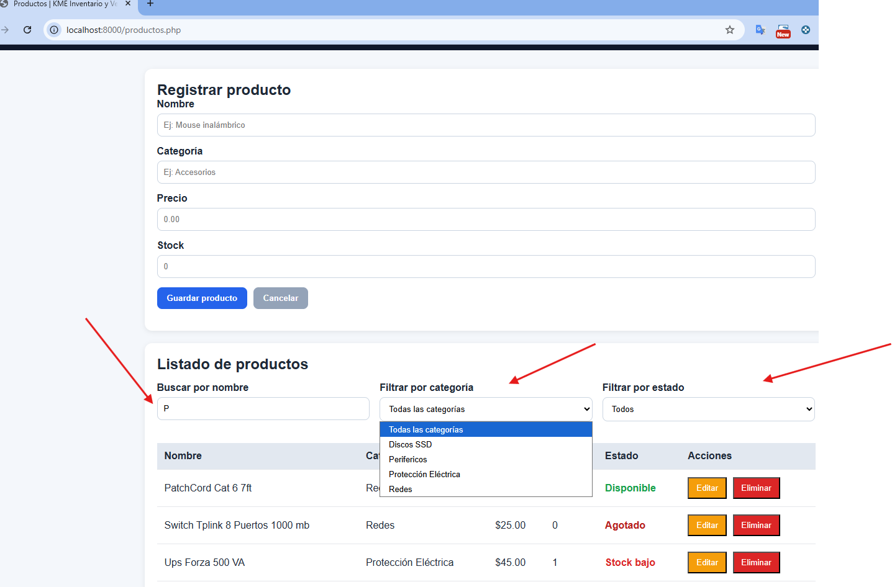

### 9. Registro de ventas

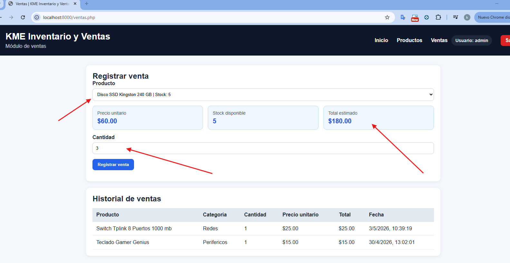

### 10. Historial de ventas

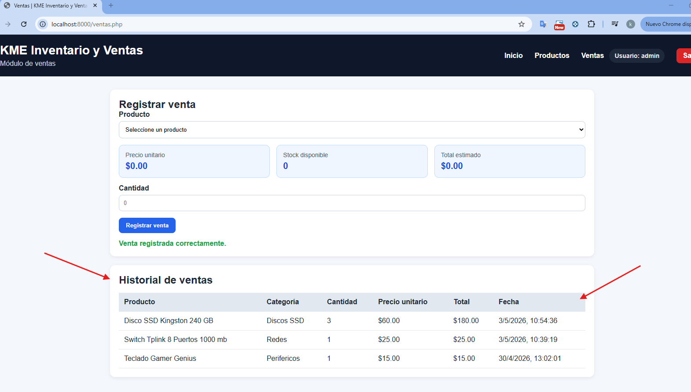

### 11. Alertas de stock bajo o agotado

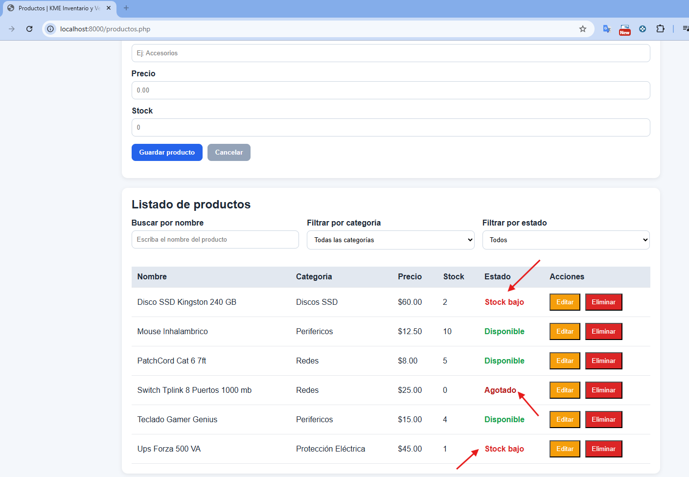

---

## Usuario de prueba

No aplica manejo de múltiples usuarios.  
El sistema utiliza un único acceso fijo para fines demostrativos y académicos.

---

## Consideraciones adicionales

- Este proyecto fue desarrollado con fines académicos.
- El sistema no utiliza base de datos en su versión principal.
- La carpeta `database` queda reservada para una posible ampliación con MySQL.
- Las carpetas `config`, `models`, `controllers` y `services` forman parte de la estructura modular prevista del sistema.

---

## Autor

**Kevin Geovanny Minga Espinoza**

---

## Enlace del repositorio

[Ver proyecto en GitHub](https://github.com/kevingeovanny16/PROGRAMACION-WEB/tree/main/KME-SISTEMA-WEB)
